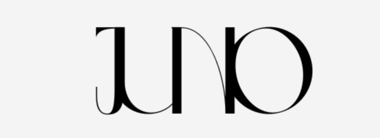

# Juno

#### ***Descubre la Magia de la Moda Infantil***

 

### Índice:

1. [Motivación](#1-motivación)
2. [Misión](#2-misión)
3. [Visión](#3-visión)
4. [Valores](#4-valores)
5. [Líneas de negocio](#5-líneas-de-negocio)
6. [Metas y objetivos](#6-metas-y-objetivos)
7. [Necesidades](#7-necesidades)
8. [Clasificación](#8-clasificación)
9. [Análisis de mercado](#9-análisis-de-mercado)
10. [Estrategia de marketing](#10-estrategia-de-marketing)
11. [Responsabilidad social corporativa](#11-responsabilidad-social-corporativa)  

   

# 1-Motivación
  
Hace algunos años, empezamos a notar en la ciudad de Barcelona grandes desechos de ropa infantil. La ropa que alguna vez fue amada por niños, ahora compartía lugar junto a los residuos diarios. Fue durante esos momentos, en los que nuestro equipo, se dio cuenta de la necesidad de un cambio en la forma en que vestían los pequeños/as y en cómo contribuimos al problema global de desechos. 
  
Nos comprometimos a encontrar una solución que permitiera vestir a los niños/as de una manera que reflejase nuestros valores de sostenibilidad y responsabilidad social. Juntos, comenzamos a investigar y buscar opciones en el mercado de la moda infantil, pero nos dimos cuenta de que no había muchas alternativas verdaderamente sostenibles en nuestra área.  

Fue entonces cuando nació la idea de Juno. Los tres nos propusimos crear una tienda de ropa infantil que no sólo ofreciera prendas de alta calidad y estilo, sino que también promoviera la sostenibilidad y la responsabilidad social en cada aspecto de nuestro negocio. Queríamos proporcionar a los niños la oportunidad de vestirse de manera  consciente y de esta manera colaborar de alguna manera en la protección de la Tierra.  

Hoy, nuestro compromiso con la moda infantil sostenible y la colaboración pasiva en el cuidado del medio ambiente sigue inspirando a las familias y a las futuras generaciones a construir un mundo más verde.  

Hoy, nuestro compromiso con la moda infantil sostenible y la colaboración pasiva en el cuidado del medio ambiente sigue inspirando a las familias y a las futuras generaciones a construir un mundo más verde.
  
   

# 2-Misión

Nuestra misión es ofrecer a los niños prendas que logren reflejar su alegría y personalidad, mientras fomentamos la sostenibilidad y la responsabilidad social en cada aspecto de nuestra elección de proveedores. 

Esta se sustenta en 3 pilares esenciales:

- **Compromiso:** Nos dedicamos a ofrecer productos de la más alta calidad, con materiales seguros y cómodos para los niños, diseñados para resistir el paso del tiempo.

- **Promoviendo la personalidad:** Valoramos la individualidad y la creatividad de cada niño. Queremos ser una fuente de inspiración para las familias que buscan prendas únicas para sus hijos.

- **Sostenibilidad y Responsabilidad Ambiental:** Reconocemos la importancia de proteger nuestro planeta para las generaciones futuras. Estamos comprometidos con prácticas de fabricación sostenibles y responsables, minimizando nuestro impacto ambiental y apoyando a comunidades locales en Barcelona. Nos esforzamos por ser líderes en la moda infantil sostenible.

Creemos que a través de nuestra pasión por la moda infantil y nuestro compromiso con la comunidad y el medio ambiente, podemos marcar una diferencia positiva en la vida de los niños y en el mundo que heredarán. 

   

# 3-Visión

Abrazamos la visión de un mundo en el que la moda infantil no solo refleje el estilo y la personalidad de cada niño, sino también su compromiso con el planeta que heredará. Nos esforzamos por ser un referente de sostenibilidad en la industria de la moda infantil.

Nuestra pasión por la moda sostenible nos impulsa a buscar constantemente proveedores ecológicos y procesos de fabricación responsables. Creemos que al ofrecer opciones de moda que respetan y protegen el medio ambiente, estamos sembrando semillas de conciencia y cuidado en las mentes jóvenes.

Cada niño que elige una de nuestras prendas se convierte en un pequeño guardián del medio ambiente, llevando consigo un mensaje de responsabilidad y respeto. Aspiramos a que los niños sean inspirados por su ropa, para que a medida que crezcan, continúen tomando decisiones que protejan nuestro mundo natural.

Nuestra visión es simple y profunda: a través de la moda sostenible, capacitamos a los niños para que se conviertan en agentes de cambio positivo en nuestro planeta. Juntos, creamos un futuro donde la moda y la sostenibilidad se entrelazan, y donde nuestros pequeños clientes se convierten en embajadores del cambio

Queremos ser reconocidos no solo por la calidad excepcional de nuestras prendas, sino también por nuestra capacidad para adaptarnos a las necesidades cambiantes de las familias y las tendencias de la moda infantil. 
Aspiramos a crear una comunidad en la que las familias confíen en nosotros para vestir a sus pequeños, sabiendo que estamos comprometidos con la calidad, la ética y la responsabilidad social. Nos esforzamos por ser una marca que crezca con sus hijos, acompañándolos en su viaje de descubrimiento y crecimiento.

   

# 4-Valores

Juno lucha firmemente por ofrecer ropa fabricada con los mejores materiales, un hecho que caracteriza nuestra calidad en producto. 

- **Diseños únicos y exclusivos**: Nuestros productos son trabajados para ser un diseño único y exclusivo, con materiales de lo más cómodos para los más pequeños de la casa. 

- **Atención al cliente**: En Juno, también tomamos consciencia de aportar una buena atención al cliente, ya que si nuestros clientes quedan satisfechos con la experiencia en nuestra tienda es una satisfacción como negocio. 

- **Proveedores**: La dedicación que hay en cada prenda hecha y la responsabilidad en vestir a un niño/a hace a nuestros proveedores destacar entre los demás. 

- **Devoluciones**: en Juno, si se desea devolver una compra, hay la posibilidad de que el cliente recupere el importe que pagó, que se devuelve en efectivo o a su tarjeta. 

- **Tallaje**: Vestir a un pequeño/a no va a ser un problema, pues en nuestras sucursales hay pasillos y pasillos de todo lo que pueda necesitar. 

- **Cuidadosos con el medio ambiente**: Contamos con bolsas en las que envolver su compra, que tienen en cuenta el medioambiente, pues la ecología nos importa tanto como vestir a tu pequeño/a.

   

# 5-Líneas de negocio

Juno principalmente está enfocada a la venta de ropa infantil. Con tallas que corresponden a niños desde los 0  hasta los 14 años. Para el público más pequeño, venimos equipados también con accesorios como biberones, chupetes y cunas, estas son hechas con la mejor madera de la región.

Los pasillos cuentan con un espacio pensado para el transporte de carritos para que el cliente pueda comprar con comodidad.

Disponemos de baño con cambiador por si ocurre una situación de esa necesidad.

 

### Àrea funcional

Pese a ser una pequeña empresa, se encuentra formada por diversos departamentos, entre los que podemos encontrar:

**Departamento de Compras**: Se responsabiliza de la gestión de las compras incluyendo la definición de las categorías de los productos, las cantidades que se comprarán dependiendo de la prenda, la calidad de las prendas teniendo en cuenta la sostenibilidad en ellas, la comparación de precios y el control de la fecha de recepción de los productos.

Roles
- 1 Gerente de Compras.  
- 2 Compradores.  
- 2 Analistas de Compras. 

 

**Departamento de Gestión de Inventarios y Almacén**: Se encarga de supervisar y administrar el flujo de productos dentro y fuera del almacén, así como mantener un registro del stock disponible en tienda. Se encuentran funciones como recepción de mercancía, almacenamiento, control de inventarios, reposición de productos, gestión de devoluciones e informes y análisis.

Roles:
- 1 Gerente de Almacen.  
- 2 Coordinadores de Inventario.  
- 7 Operadores de Montacargas.

 

**Departamento de Logística**: Trabaja junto al departamento de  gestión de inventario, pero también abarca otros aspectos como la planificación de rutas de envío, el transporte, la gestión de almacenes, la distribución y la optimización de costos logísticos.  
  
  Roles:
  - 1 Gerente de Logística.
  - 1 Coordinador de Almacén.
  - 8 Transportistas.

 

**Departamento de Ventas y Atención al Cliente**: Se encarga de la venta directa de productos a los clientes en la tienda. También puede incluir funciones de atención al cliente, como resolver consultas de los clientes y procesar devoluciones o cambios.

  Roles:  
 - 1 Gerente de Ventas y Atención al Cliente.
 - 9 Dependientas de Tienda.
 - 2 Atención al cliente.

 

**Departamento de Marketing y Publicidad**: Encargado de la promoción de la tienda y sus productos, la publicidad, la estrategia de precios y la creación de campañas para atraer a los clientes y aumentar las ventas, además de encargarse de la presentación de la mercancía en la tienda, diseñando la disposición de los productos y creando exhibiciones atractivas para los clientes.
Roles:
- 1 Gerente de Marketing y Publicidad.  
- 2 Analistas de Marketing.  
- 3 Especialistas en Marketing.
- 1 Diseñador Gráfico. 

 

**Departamento de RRHH**: Se encarga de la gestión del flujo de empleados, llevando al día la documentación del personal, la uniformidad de los empleados y la capacitación de estos.

Roles:  
- 1 Gerente de Recursos Humanos.
- 2 Selección de Personal.
- 2 Especialistas en Relaciones Laborales.

 

**Departamento de Tecnología de la Información(TI)**: Encargado de mantener y gestionar los sistemas informáticos y tecnológicos utilizados en la tienda.
Roles:
- 1 Gerente de Departamento de Tecnología de la Información(TI).
- 2 Especialista en Seguridad de la Información.
- 2 Especialistas en Soporte Técnico.

 

### Tipos de empleados:

 
Nuestro equipo cuenta con gente de todas las edades, tenemos una plantilla confirmada por 54 personas, repartidas en 3 tiendas. Tenemos intención de situar la primera tienda en Pl. de Lesseps, número 23, código postal 08023 en Barcelona. Las funciones desempeñadas por los empleados son desde atención en caja hasta atención personalizada. Nuestro perfil de empleado opta más por los candidatos que cuentan con experiéncia previa en el sector, aunque a todo aquel que le interese formarse y crecer, le damos la bienvenida.

En Juno, pretendemos contar con un buen personal, el cual tiene buenas condiciones de trabajo y preste un buen servicio, de esta manera, generariamos las buenas opiniones en los clientes. 

Aparte de lo mencionado arriba, mantenemos un modelo de negocio sostenible.

 

### Cómo generar igresos:

- **Atención al cliente:**  Nuestro objetivo es ofrecer una buena experiencia y ser un referente en cuanto a gusto y calidad para aquellos que nos conocen y han comprado alguna vez en nuestras tiendas. Y para los que no, los esperamos con ansias de que visiten nuestras sucursales.

- **Venta de producto:**  Nuestra principal fuente de ingresos proviene de la ropa y accesorios de niños/as que vendemos. 

- **Personalización de Ropa:**  Uno de nuestros servicios es el de la personalización, permitiendo a los clientes agregar el nombre de sus hijos a la ropa que compran. Esta opción pretende generar ingresos adicionales y crea prendas únicas y especiales.

- **Promociones y ofertas especiales:**  Tenemos promociones y ofertas exclusivas en momentos concretos, en temporadas concretas. Esto fomentaria la fidelidad de los clientes ya existentes y atrae a los nuevos. Así generaríamos ventas adicionales.

- **Programa de fidelidad:**  Para nuestros queridos clientes fieles, les damos descuentos o ventajas exclusivas. De esta manera fomentamos la fidelidad del cliente y generamos ingresos por las ventas repetidas.

- **Colaboraciones:**  Nos abrimos a colaborar con otras marcas que tengan productos parecidos para poder así aumentar nuestras ventas.

-  **Venta en línea:**  A través de nuestra plataforma online, pretendemos llegar a un público más amplio y aumentar las ventas. 

   

# 6-Metas y objetivos

Como empresa nos hemos propuesto los siguientes objetivos:

### A corto plazo (primer año):

- **Iniciar Operaciones en Línea**: Establecer una plataforma de comercio electrónico funcional y atractiva para complementar las tiendas físicas en los primeros seis meses.

- **Incremento de Clientes**: Aumentar la base de clientes en las tiendas físicas y en línea en un 20% durante el primer año.

- **Colaboraciones Locales**: Establecer alianzas con al menos dos escuelas locales para promocionar la marca y productos a las familias.

- **Programa de Lealtad**: Implementar un programa de lealtad que recompense a los clientes frecuentes con descuentos y regalos exclusivos en el segundo trimestre.

- **Recuperación de la Inversión**: Recuperar la inversión inicial.

 

### A largo plazo:

- **Liderazgo en el Mercado Local**: Convertirnos en la tienda líder de ropa infantil en Gràcia, siendo la primera opción para los padres en el barrio.

- **Expansión Regional**: Desarrollar una presencia en otras áreas de Barcelona y sus alrededores para ampliar nuestro alcance y atraer a clientes de toda la región.

- **Crecimiento en Ventas Anuales**: Establecer un crecimiento constante en las ventas anuales, con un objetivo específico de aumento porcentual.

- **Desarrollo de Línea Sostenible**: Expandir la oferta de ropa infantil sostenible y convertirla en una parte significativa de ventas totales.

- **Diversificación de Productos**: Ampliar la oferta de productos para incluir artículos relacionados con niños, como juguetes y accesorios.

- **Beneficios**: Esperamos que los beneficios crezcan en temporadas más altas como la vuelta al cole y en periodo de rebajas.  

   

# 7-Necesidades

En el mundo de la moda infantil, la competencia es desafiante y la satisfacción del cliente es primordial. Para destacar en este mercado, es fundamental ofrecer una experiencia de compra impecable, tanto en la tienda física como en línea. Para ello consideramos necesario digitalizar nuestro negocio, esto incluye gestionar a través de herramientas digitales los siguientes aspectos:

- **Registro de Inventario**: Necesitamos garantizar que siempre haya suficiente stock disponible para satisfacer las necesidades de los clientes, tanto en la tienda física como en línea. Esto evita la pérdida de ventas debido a productos agotados.

- **Ventas**: En la moda infantil, es importante registrar y rastrear las ventas de manera eficiente para comprender las preferencias de los clientes y brindar un servicio personalizado.

- **Comercio en línea**: La presencia en línea es esencial en la era digital. Necesitamos gestionar el comercio electronico para llegar a un público más amplio y ofrecer a los clientes la comodidad de comprar en línea. Esto amplía el alcance y aumenta las oportunidades de ventas.

- **Relaciones con clientes**: Necesitamos gestionar las relaciones con los clientes para mantener un registro de sus interacciones, preferencias y necesidades, lo que permite brindar un servicio personalizado y fortalecer la lealtad de la marca.

- **Facturación**: Necesitamos registrar las transacciones y mantener un control financiero, tanto para las ventas en la tienda física como en línea.

- **Compras**: Necesitamos gestionarlas compras para mantener un inventario actualizado y gestionar proveedores de manera eficiente, lo que nos garantiza que siempre los productos disponibles y un control de costos.

- **Contabilidad**: La contabilidad es fundamental para controlar los ingresos y gastos, necesitamos presentar informes fiscales y cumplir con las obligaciones financieras.

- **Recursos Humanos**: A pesar del tamaño pequeño de la empresa, la gestión de recursos humanos es importante para garantizar un flujo de trabajo eficiente y la satisfacción de los empleados.

- **Logística**: Necesitamos tener un control de la gestión durante distribución de nuestros productos.

- **Marketing**: Necesitamos digitalizar nuestras campañas de marketing.

- **Subscripciones**: Necesitamos gestionar los planes de subscripción de nuestros clientes y mantener la confidencialidad de sus datos.

   

# 8-Clasificación

Juno se clasifica en diversos aspectos que definen su naturaleza y estructura. Esta clasificación proporciona una visión general de la empresa y su contexto empresarial.

|||                    
|---|-
| Sector de actividad | Terciario     
| Tamaño | Pequeña/mediana (alrededor de 50 empleados)  
| Propiedad del capital | Privada   
| Ámbito de actividad | Local/Regional   
| Destino de los beneficios | Ánimo de lucro 
| Forma jurídica | Sociedad limitada (la responsabilidad de los propietarios está limitada a sus aportaciones de capital) 

   

# 9-Análisis de mercado

Niños de 0 a 14 años y sus padres son el público objetivo principal de Juno. Este grupo demográfico se divide en varias categorías según la edad:

- Bebés (0-2 años)
- Niños pequeños (3-6 años)
- Niños en edad escolar (7-11 años)
- Adolescentes (12-14 años)

En la siguiente tabla se describen los puntos clave del mercado de ropa infantil:

 

---
| **Aspecto** |       **Descripción**                      
|---|-
| Tamaño | El mercado de ropa infantil en Gràcia es considerable debido a la densidad de población en este barrio de Barcelona. También se refleja en la gran cantidad de escuelas que hay. Y aunque predomina la educación privada, los niños son libres de vestir lo que quieran fuera de las aulas.      
| Público objetivo | Gràcia es un barrio con una alta concentración de familias, lo que lo hace ideal para este tipo de negocio.    
| Competéncia | Existen varias tiendas de ropa infantil en Gràcia, tanto locales independientes como franquicias de marcas conocidas. Algunos competidores pueden tener una preséncia en línea también. 
| Tendencias del mercado | **Sostenibilidad**: La conciencia ambientalestá en aumento, por lo que la oferta de ropa infantil sostenible es una tendéncia importante. Los padres buscan ropa hecha de materiales orgánicos y métodos de producción transparentes.   **Comercio electrónico**: El comercio en línea es cada vez más popular.    **Exclusividad**: Algunos padres aprecian la ropa personalizada y única para sus hijos. Ofrecer opciones personalizadas de compra será una de nuestras ventajas competitivas.    **Experiencia de compra**: Ofrecer unaexperiencia de compra agradable y acogedora en la tienda física es factor clave para atraer clientes. 
| Demanda | La demanda de ropa infantil es constante, pero puede haber picos estacionales, como la temporada de regreso a la escuela y las festividades navideñas.
| Barreras de entrada | Las barreras de entrada incluyen la inversión inicial en inventario, la competencia establecida y la necesidad de establecer una marca sólida y confiable.
| Colaboraciones y alianzas | Se pueden explorar oportunidades de colaboración con escuelas locales, guarderías y otros negocios relacionados con niños.

   

# 10-Estrategia de marketing

Si bien nuestra ropa está diseñada para niños de 0 a 14 años, reconocemos que los padres son quienes toman las decisiones de compra y tienen el poder adquisitivo para realizarlas. Por lo tanto, la estrategia se orienta a atraer padres, educar sobre sostenibilidad, generar confianza en la marca y fomentar la lealtad a largo plazo.

Para iniciar nuestra estrategia de marketing aprovecharemos las tendencias demográficas actuales. Según datos proporcionados por el Instituto Nacional de Estadística (INE), la edad promedio de maternidad y paternidad en España se sitúa en 32,6 años. Por lo tanto, nuestra estrategia se orientará hacia las redes sociales, específicamente Instagram y Facebook, que son plataformas muy utilizadas por este grupo demográfico.
  

---
| **Acciones Marketing Digital**          |
|----------------------|
|  Crear  perfiles de negocio en redes sociales para llegar de manera efectiva a los padres y madres que buscan moda sostenible para sus hijos. 
| Colaborar con influencers que se dediquen a ofrecer contenido relacionado con la crianza, la moda infantil y la sostenibilidad.   
|Publicar contenido relevante en nuestras RRSS destacando la calidad de nuestros productos, como por ejemplo, con historias y publicaciones en tiempo real.                    |

 

---
| **Acciones Email Marketing**          |
|----------------------|
|Construir una lista de suscriptores para que los visitantes interesados puedan recibir actualizaciones y ofertas exclusivas.           |
Crear correos automatizados para celebrar cumpleaños de niños con ofertas especiales.                    |
 

La ***creación de un calendario de publicación*** nos ayudara con fechas claves como temporadas de cambio, eventos escolares y días festivos para planificar y programar contenido relevante.

 

---
| **Acción  calendario de publicación**          |
|------------------------------------------------|
|Promoción de productos específicos, consejos relacionados con las temporadas, contenido educativo sobre moda sostenible y mensajes temáticos relacionados con eventos escolares y festivos.                                                 |

   

# 11-Responsabilidad Social Corporativa

Desde Juno contribuimos a la mejora de la sociedad y del medio ambiente a través de las siguientes prácticas y acciones:

- **Productos Sostenibles**: Ofrecemos una línea de ropa infantil fabricada con materiales sostenibles y ecológicos y promocionamos activamente la importancia de la moda sostenible.

- **Ética en la Cadena de Suministro**: Nos aseguramos que nuestros proveedores sigan prácticas éticas en la producción de la ropa, como el respeto de los derechos laborales y la eliminación de prácticas dañinas para el medio ambiente.

- **Reducción de envases y reciclaje**:  Implementamos prácticas para reducir los residuos, como la utilización de envases eco-amigables y la promoción de la reutilización y el reciclaje entre los clientes.

- **Cuidado de Empleados**: Promovemos un ambiente laboral seguro y saludable, proporcionando capacitación y oportunidades de desarrollo para los empleados.

- **Ética publicitaria**: Evitamos prácticas publicitarias engañosas y garantizamos un marketing ético acorde a los valores de la empresa.

